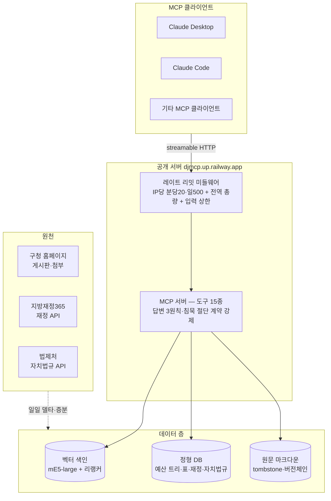

# 아키텍처 — 멀티사이트 확장을 전제한 구조

> 목표는 대전 6개 행정 홈페이지(대전광역시청 + 5자치구)로의 확장. 구조는 처음부터
> "사이트 추가 = 폴더 추가"가 되도록 플랫폼과 사이트를 분리했다.

## 전체 구조

## 설계 결정과 이유

### 플랫폼 / 사이트 분리
- `platform/` = 사이트 비종속 로직(파이프라인·서버·검증기) / `sites/<id>/` = 사이트별 데이터·설정.
- 새 자치구 온보딩은 설정(site.toml)과 데이터 생산이지 코드 분기가 아니다. 자치법규 축은
  사이트 설정 2줄(기관 코드)로 새 사이트에 동승한다.
- 엔드포인트도 같은 구조를 따른다: `/junggu/mcp`(개별) · `/all/mcp`(통합, 교차 회수).

### 검색: 3채널 + 리랭커
- 벡터 검색(다국어 mE5-large) + 어휘 채널 + 지명 채널의 3채널 후보 수집 → 리랭커(jina-v2)가 최종
  순위. 행정문서 특유의 "제목은 비슷한데 연도·부서만 다른" 후보군에서 리랭커가 판별력을 진다.
- 검색 품질은 감이 아니라 게이트: 역생성 160문항 hit@10 상시 채점, 기준 미달 변경은 기각
  (실제로 풀 축소 실험이 33% 빨랐지만 hit@10 게이트 미달로 기각된 기록이 [results.md](results.md)에).

### 정형 축이 수치의 정본
- 예산·재정 수치의 정본은 문서 파싱이 아니라 정형 축(지방재정365 API·예산 트리 DB)이다.
- 문서 축과 정형 축이 서로를 교차 대조한다 — 축이 둘이라 어느 한쪽의 결함이 드러난다.

### 증분·비파괴 갱신
- 일일 델타: 원장(서명) diff로 신규·개정·삭제 탐지 → 변경분만 증분 색인 → 자동 배포.
- 대량 추가도 전체 재색인이 아니라 비파괴 증분(결정론적 ID로 기존 색인과 공존).
- 삭제는 물리 삭제가 아니라 tombstone — "그 문서는 내려갔고 후속 버전은 이것"이라고 답할 수 있는
  상태를 유지한다.

### 운영: 단일 컨테이너 + 명시적 트레이드오프
- 단일 컨테이너 + 볼륨(로컬 DB 캐시) + 별도 벡터 DB 서비스. 무중단 헬스 게이트 배포.
- 레이트 리밋 상태는 인메모리 — 볼륨 부착 서비스는 레플리카가 불가하다는 플랫폼 제약을 확인하고
  채택한 트레이드오프(전제가 깨질 때가 고칠 때). 이런 "수용한 한계"는 숨기지 않고 문서화한다.
- 프록시 뒤 클라이언트 IP 키잉은 헤더 체인의 홉 수에 비의존하는 방식(우측→좌측 첫 공인 IP 스캔)
  — 실측으로 최우측 키잉이 무효임을 확인하고 교정했다. 부팅 후 첫 요청들의 체인을 로그로 남겨
  프록시 구조 변화(침묵 드리프트)를 감시한다.

## 규모 (대전 중구, 2026-07 기준)

| 항목 | 규모 |
|---|---|
| 서빙 문서(지식 단위) | 약 5.5만 건 |
| 벡터 색인 | 약 99만 청크(본문 85만·메타 5만·표 9만) |
| 구조화 표 | 약 8.9만 테이블 |
| 재정 정형 데이터 | 지방재정365 122개 상품·15개 연도 |
| 자치법규 | 472건(조례 389·규칙 68·의회규칙 15) |
| MCP 도구 | 15종 |
