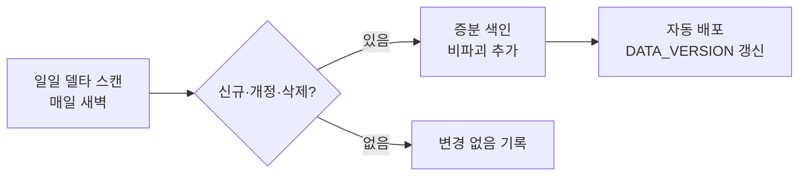

# 파이프라인 — 수집에서 서빙까지, 그리고 그것을 감시하는 층

> 코드가 아니라 구조를 공개한다. 각 단계의 검증 수단은 [methodology.md](methodology.md)의
> 무결성 렌즈 5문항과 1:1로 대응한다.

## 본선: 문서가 흐르는 길

| 단계 | 하는 일 | 지키는 것 |
|---|---|---|
| 수집 | 게시판 순회, 첨부 다운로드, 본문형 게시물 인입 | 선언총건수 대조·순번 연속성·실패 다운로드 게이트·총-데드라인 가드 |
| 변환 | HWP/HWPX/PDF → 마크다운 (표 구조 보존) | 차등 하네스 3자 대조·0-silent 손실 마커·품질 채점 |
| 비식별 | 개인정보 마스킹 | 양방향 보존 골든(과소=유출·과잉=손상) |
| 구조화 | 표 → 질의 가능한 테이블, 예산서 → 계층 트리 | 트리합 불변식(부모=자식합)·회계 분류 검증 |
| 색인 | 다국어 임베딩(mE5-large) + 리랭커 2단, 정형 SQLite | 역생성 문항 상시 채점(hit@10 게이트) |
| 서빙 | MCP 도구 15종, 3채널 검색+리랭킹 | 답변 3원칙·침묵 절단 계약·grounded=False 거절 |

## 정형 축: 문서가 아니라 데이터로 들어오는 길

문서 파싱에는 한계가 있다(스캔본·병합셀·노후 문서). 그래서 **수치의 정본은 정형 축**이 따로 진다:

- **지방재정365**: 공식 재정 데이터 API → 편성·집행 확정치. 문서 파싱 결과와 **교차 대조**되어
  파이프라인 결함 탐지기 역할도 겸한다(실제로 서빙 버그 2건을 이 대조가 잡았다).
- **법제처 국가법령정보**: 자치법규 원문·연혁. 법규는 살아있는 문서라 **일일 증분**(서명 diff)으로
  개정을 따라가고, 폐지분은 tombstone 처리 + 모든 응답에 `데이터기준일` 동반.

## 갱신: 살아있는 데이터

- 삭제·교체된 문서는 지우는 게 아니라 **tombstone·버전체인**으로 남긴다 — 옛 버전을 물으면
  "새 버전이 있다"고 안내하는 것도 정직성의 일부.
- 서빙 중 데이터 버전은 `DATA_VERSION`으로 노출된다.

## 감시선: 사람이 안 봐도 도는 것들

| 장치 | 주기 | 역할 |
|---|---|---|
| 결함 스캔 오케스트레이터 | 주간 | 탐지기 5계층(쿼리로그 신호·트리합·재정 대조·계약 퍼저·역생성 채점) 일괄 가동 |
| 자가복구 워치독 | 상시 | 컨테이너가 스스로 공개 /health를 점검, 연속 실패 시 재기동(발동 0회=성공지표) |
| 업타임 감시 | 5분 | 외부에서 /health 감시, 연속 실패 시 알림 |
| 자가 계측(selfmetrics) | 60초 | 메모리·연결·리랭커 대기·429 카운터 궤적 — 장애 시 사후 분석 재료 |

## 이 구조에서 배운 것 (일반화 가능한 교훈)

1. **완전성은 대조로만 보장된다** — "크롤러가 정상 종료했다"는 완전성의 증거가 아니다.
2. **손실은 조용히 일어난다** — 변환 실패의 기본값은 예외가 아니라 빈 텍스트다. 0-silent 마커 없이는 모른다.
3. **수치 정본은 정형 데이터가 진다** — 문서 파싱은 근거 제시용, 확정 수치는 공식 API와 교차 대조.
4. **골든은 실패를 먼저 봐야 한다** — 옛 코드에서 실패하는 걸 확인 못 한 테스트는 안 잡는 테스트다.
5. **검증기 자신도 검증 대상이다** — 기지 결함 주입을 통과한 탐지기만 믿는다.
